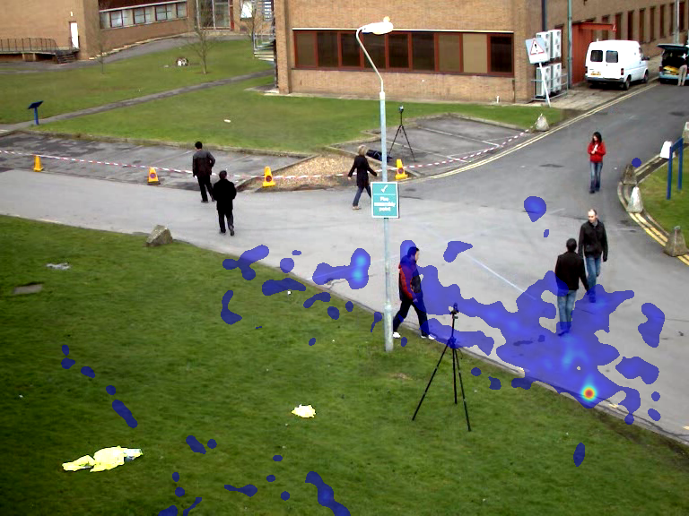
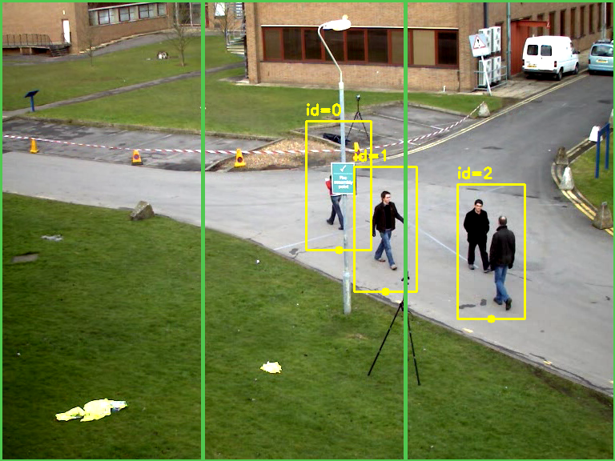

# Delhi Metro Smart Crowd Analytics

A YOLOv8-based crowd analytics pipeline for metro platforms: zone-wise occupancy detection, density classification, hourly-style trend analytics, crowd heatmaps, and redistribution alerts — built end to end (detection → tracking → zone logic → analytics → dashboard) as a personal portfolio project.



**What the pipeline actually outputs** — left to right: raw YOLO/HOG detections with foot-points marked, the same frame with zone boundaries overlaid (so you can see people getting split into different zones), and the accumulated heatmap above:

<table>
<tr>
<td></td>
<td></td>
</tr>
</table>

## Problem statement

Delhi Metro carried a record 235.8 crore (2.358 billion) passenger journeys in 2025, averaging roughly 64.6 lakh trips a day, with a single-day peak of about 81.87 lakh passengers on 8 August 2025 (DMRC, 2025). Ridership is heavily concentrated on a handful of corridors — the Blue and Yellow lines in particular — which is why DMRC has had to respond with measures like additional coaches and active crowd-control at high-traffic interchanges such as Rajiv Chowk.

This project targets three concrete, related problems that show up on a crowded platform:

1. **Overcrowding** — knowing *when* a section of the platform has crossed from busy to genuinely unsafe/uncomfortable, not just "there are people here."
2. **Rush-hour congestion trends** — knowing *when* crowding builds and recedes over the day, not just a single snapshot count.
3. **Uneven distribution** — platforms rarely fill evenly. People cluster near stairs/escalators/the usual entry point while other sections sit comparatively empty, which is itself a safety and flow problem.

## What it does

- **Detection + tracking**: YOLOv8 (Ultralytics) detects people frame by frame; ByteTrack (built into Ultralytics) keeps consistent identities across frames.
- **Zones**: the platform is split into configurable polygon zones (default: three equal sections). Each zone has its own comfortable-capacity number.
- **Density classification**: each zone's live occupancy vs. capacity maps to `LOW / MEDIUM / HIGH / CRITICAL`.
- **Heatmap**: foot-positions are accumulated across the whole clip into a smoothed density heatmap, showing where the crowd actually pools.
- **Hourly-style analytics**: raw per-frame zone counts are aggregated into time buckets (set the bucket to 3600s for true hourly analytics on real multi-hour footage).
- **Redistribution suggestion**: compares zone occupancy ratios and proposes where to redirect incoming passengers when one zone is meaningfully fuller than another.
- **Surge / anomaly detection**: flags a zone whose bucket-over-bucket occupancy jumps sharply — a possible stampede-risk signal (e.g., right after a train arrival).
- **Naive forecast**: a short-horizon linear-trend projection of the next bucket per zone, for a "what's likely next" read.
- **Streamlit dashboard**: ties all of the above into live status cards, a trend chart with forecast, the heatmap, the annotated video, and raw data with CSV export.

## Architecture

```
video file
   │
   ▼
detector.py        YOLODetector (YOLOv8 + ByteTrack)  or  HOGDetector (offline fallback)
   │  per-frame: [{id, bbox, foot_point}, ...]
   ▼
zones.py           ZoneManager: scales normalized zone polygons to frame size,
   │                assigns each foot-point to a zone, classifies density
   ▼
   ├──► heatmap.py     accumulates foot-points → smoothed density heatmap.png
   └──► analytics.py   AnalyticsLogger → analytics_raw.csv
                         → bucket_aggregate() → analytics_hourly.csv
                         → redistribution_suggestion() / detect_surge() / forecast_next_bucket()
   │
   ▼
pipeline.py        draws zone outlines + live legend + boxes → annotated_video.mp4
                    writes summary.json (final state + alerts)
   │
   ▼
dashboard/app.py   Streamlit UI on top of all the above
```

## Project structure

```
delhi-metro-crowd-analytics/
├── .github/workflows/
│   └── ci.yml                 runs the test suite + a HOG smoke test on every push
├── assets/                    screenshots used in this README (permanent, tracked)
├── config/
│   └── zones.json            zone polygons (normalized coords) + capacities + thresholds
├── data/
│   └── sample_platform_footage.avi   placeholder demo clip (see note below)
├── src/
│   ├── detector.py           YOLODetector + HOGDetector + CentroidTracker
│   ├── zones.py               Zone / ZoneManager, density classification
│   ├── heatmap.py             HeatmapAccumulator
│   ├── analytics.py           logging, bucketing, suggestions, forecast, surge detection
│   └── pipeline.py            orchestrates everything end to end (CLI entry point)
├── tests/                     pytest unit tests for the pure-logic modules
├── tools/
│   └── zone_selector.py       interactive tool to draw custom zones on your own footage
├── dashboard/
│   └── app.py                 Streamlit dashboard
├── output/                    where a real run's results land (gitignored except a small example)
├── requirements.txt
├── LICENSE
└── README.md
```

## Testing & CI

```bash
pip install pytest
pytest tests/ -v
```

26 tests cover the pure-logic modules — zone geometry/density classification (`test_zones.py`), the bucketing/forecast/surge/redistribution functions (`test_analytics.py`), and the offline `CentroidTracker` (`test_detector.py`) — none of them need a video file or model weights, so they run in well under a second. `.github/workflows/ci.yml` runs this suite plus a 30-frame HOG-backend smoke test of the real pipeline on every push, without ever needing to install `ultralytics`/`torch` or download any model weights in CI.

## Setup

```bash
cd delhi-metro-crowd-analytics
python -m venv venv && source venv/bin/activate   # optional
pip install -r requirements.txt
```

## Usage

### Run the pipeline directly (CLI)

```bash
python src/pipeline.py --video data/sample_platform_footage.avi --backend yolo
```

Useful flags: `--backend {yolo,hog}`, `--detect-every N` (run the detector every Nth frame for speed), `--bucket-seconds 3600` (use real hourly buckets on real multi-hour footage), `--sim-start 08:00:00` and `--sim-seconds-per-video-second 60` (maps a short demo clip onto a believable rush-hour wall-clock timeline so the trend chart looks meaningful even on a short clip), `--max-frames N` (cap for quick tests).

### Run the dashboard

```bash
streamlit run dashboard/app.py
```

Pick the bundled sample or upload your own clip, choose a backend, and hit **Run Analysis**.

## Using real platform footage

The bundled clip is a generic placeholder (see note below) and the default `config/zones.json` just splits the frame into three equal vertical thirds. For a real demo:

1. Point `tools/zone_selector.py` at a frame from your real camera footage and click out actual zone polygons (near stairs, platform center, far end, etc.) — it saves them to `config/zones.json` in the same normalized format.
2. Run the pipeline or dashboard against your footage as usual; everything downstream (density, heatmap, analytics, alerts) automatically adapts to the new zone shapes and capacities.

`zone_selector.py` needs a local display (OpenCV GUI window) — run it on your own machine, not on a headless server.

## A note on the sample footage and detector backends

I don't have access to real DMRC platform CCTV footage, so the bundled `data/sample_platform_footage.avi` is OpenCV's well-known public-domain pedestrian test clip, used purely to prove the full pipeline end to end — detection, zones, heatmap, analytics, dashboard. It's generic outdoor pedestrian footage, not a metro platform; swap in real or stock platform/crowd footage for an authentic demo.

Two detector backends are included on purpose, not as a shortcut:

- **`yolo` (recommended/default for real use)** — YOLOv8 + ByteTrack. Downloads model weights (~6MB) from Ultralytics' servers on first run, so it needs internet access once; cached after that.
- **`hog`** — a fully offline OpenCV HOG person detector + a lightweight custom centroid tracker (`CentroidTracker` in `detector.py`). Lower accuracy and no real re-identification, but useful for a quick dependency-free smoke test, or in network-restricted environments. The sample outputs shipped in `output/` were generated with this backend, since the sandbox this was built in blocks the YOLO weight download (a sandbox-network restriction, not a code limitation — it downloads normally on a regular machine).

## Sample output

Running the command above regenerates everything in `output/`: `annotated_video.mp4` (zone outlines, live legend, detection boxes), `heatmap.png`, `analytics_raw.csv` / `analytics_hourly.csv`, and `summary.json` (final zone state, redistribution suggestion if any, surge alerts if any). The video and heatmap aren't tracked in git — they're a few/tens of MB and trivially regenerable by running the pipeline once, so there's no reason to carry them around in version control. The small `analytics_raw.csv` / `analytics_hourly.csv` / `summary.json` from one real run are kept as a tracked worked example; the screenshots at the top of this README are the permanent visual reference for the video/heatmap, generated from the same 795-frame / 79.5s bundled clip, simulated as an 08:00–09:20 rush-hour window (60x time-scale), HOG backend, 10-minute buckets.

## Limitations (honest, on purpose)

- The sample footage isn't a real metro platform — the zone/density/heatmap logic is validated on generic pedestrian video, not on actual platform geometry or actual crowd densities. It should be re-run on real footage before treating any specific number here as representative.
- The HOG backend is a testing convenience, not the intended production detector — it misses people YOLOv8 would catch, especially with partial occlusion.
- Zone capacities and density thresholds in `config/zones.json` are illustrative defaults, not calibrated against DMRC's actual platform safety norms.
- The forecast is a naive linear trend over the last few buckets, not a trained time-series model.
- ID tracking can still switch identities through heavy occlusion/crossing paths, which affects flow-direction analysis more than raw occupancy counts.
- Operates on video files, not a live RTSP/camera feed yet.

## Possible future work

- Live RTSP/camera ingestion instead of pre-recorded files
- Calibrate zones and capacities against real DMRC platform dimensions and safety guidelines
- Detect train-arrival events specifically, since that's likely the biggest driver of bursty zone occupancy, and separate "steady crowd" from "just-arrived train" spikes
- Replace the naive linear forecast with a proper time-series model (e.g. exponential smoothing/Prophet)
- Edge/on-device deployment for real station hardware

## Disclaimer

Personal academic/portfolio project. Ridership statistics referenced from public DMRC reporting (2025). Not affiliated with, endorsed by, or built using any non-public data from DMRC.

## License

MIT — see [LICENSE](LICENSE).
