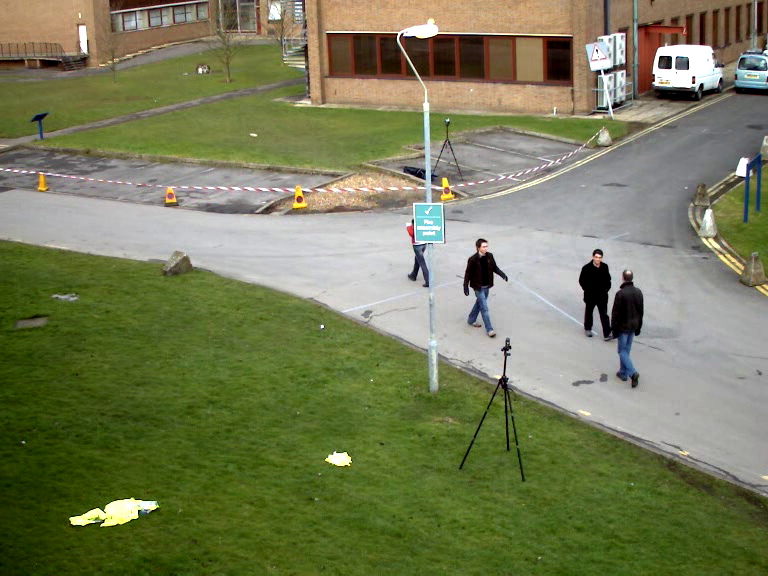
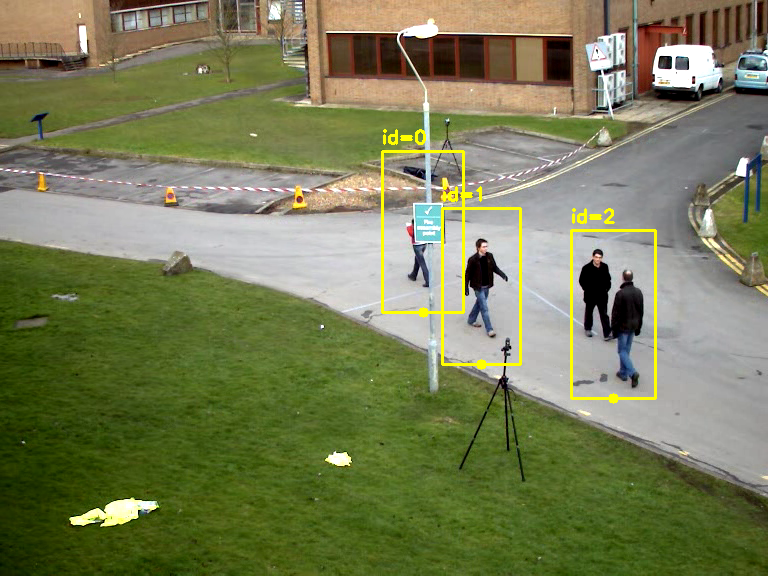

# How This Project Works: A Computer Vision Walkthrough

This document explains the *Delhi Metro Smart Crowd Analytics* codebase from the ground up. It assumes you can read Python comfortably but have little or no computer vision (CV) background. Every code snippet and every printed output in this document was actually run against this project's real code and the bundled sample video — nothing here is hypothetical.

How to use this: read it top to bottom the first time. After that, treat it as a reference — jump to whichever module you're touching.

---

## Part 1 — The big picture before any code

### 1.1 What problem are we even solving?

Forget code for a second. The real-world task is: *point a camera at a metro platform, and automatically know how crowded each part of it is, over time.*

Break that down and you get four sub-problems:

1. **Find the people** in a video frame. (→ "detection")
2. **Keep track of *who's who*** from one frame to the next, so you don't double-count the same person walking past. (→ "tracking")
3. **Know *where on the platform*** each person is — not just "there's a person," but "there's a person near the stairs." (→ "zones")
4. **Turn raw counts into insight** — is this zone overcrowded? Is it getting worse? Should people be redirected? (→ "analytics")

That's the entire project. Everything else is plumbing around these four ideas.

### 1.2 The pipeline, end to end

```
                         ┌──────────────────────┐
   video file  ───────►  │   detector.py        │   "find the people"
                         │   (YOLODetector or   │   → list of {id, bbox, foot}
                         │    HOGDetector)      │
                         └───────────┬──────────┘
                                     │  foot-points (where each person is standing)
                                     ▼
                         ┌──────────────────────┐
                         │   zones.py           │   "which named region is
                         │   (ZoneManager)      │    each person standing in?"
                         └───────────┬──────────┘
                                     │  per-zone counts
                       ┌─────────────┴─────────────┐
                       ▼                             ▼
          ┌────────────────────┐         ┌───────────────────────┐
          │  heatmap.py        │         │  analytics.py         │
          │  "where do people  │         │  "log it, bucket it,  │
          │   pool over time?" │         │   spot trends/alerts  │
          └────────────────────┘         └───────────────────────┘
                       │                             │
                       └─────────────┬───────────────┘
                                     ▼
                         ┌──────────────────────┐
                         │   pipeline.py        │   orchestrates all of the
                         │   (run_pipeline)     │   above, draws the overlay,
                         │                      │   writes every output file
                         └───────────┬──────────┘
                                     ▼
                annotated_video.mp4, heatmap.png,
                analytics_raw.csv, analytics_hourly.csv, summary.json
                                     │
                                     ▼
                         ┌──────────────────────┐
                         │   dashboard/app.py   │   Streamlit UI that calls
                         │                      │   run_pipeline() and displays
                         │                      │   everything it produces
                         └──────────────────────┘
```

If you only remember one thing from this document, remember this diagram. Every file in `src/` is just one box in it.

### 1.3 In plain English: the life of a single video frame

Before we touch any real code, here's the story of what happens to *one frame* of video as it flows through the system:

1. OpenCV hands `pipeline.py` one frame — really just a big grid of pixel-color numbers (more on this in 2.1).
2. That frame goes into a **detector**, which scans it and reports back "I think there's a person here, here, and here" as a list of rectangles (bounding boxes).
3. For each detected person, we compute their **foot-point** — roughly, where their feet touch the ground — because that's a much better stand-in for "where is this person on the platform" than the center of their whole body.
4. Each foot-point gets checked against every defined **zone** (a polygon shape someone drew on the frame) to see which zone, if any, contains that point.
5. We now know a count per zone for this frame. That count gets compared to the zone's configured capacity to produce a density label: `LOW`, `MEDIUM`, `HIGH`, or `CRITICAL`.
6. The foot-point also gets added to a running **heatmap** accumulator — think of it as snow that piles up wherever people repeatedly stand.
7. The count gets written to a growing **log** (one row per processed frame), which later gets grouped into time buckets for trend charts.
8. Finally, `pipeline.py` draws all of this — zone outlines, boxes, a little status legend — onto the frame and writes it to the output video.

Read that list again once you've gone through Part 2 below — it'll click into place.

---

## Part 2 — The computer vision concepts, with hands-on demos

This is the part written specifically for "new to CV." Each concept below has a tiny, self-contained demo you can copy-paste and run yourself — none of them need the full project installed, just OpenCV and NumPy (or, for a couple, the project's own modules).

### 2.1 An image is just a grid of numbers

When OpenCV reads a video frame, you get back a NumPy array. Here's what that actually looks like for a real frame from the bundled sample video:

```python
import cv2

cap = cv2.VideoCapture('data/sample_platform_footage.avi')
ok, frame = cap.read()
cap.release()

print('Type of frame object:', type(frame))
print('Shape (height, width, channels):', frame.shape)
print('Data type of each pixel value:', frame.dtype)
print('Pixel at row=10, col=10 (as Blue, Green, Red):')
print(frame[10, 10])
```

**Real output:**
```
Type of frame object: <class 'numpy.ndarray'>
Shape (height, width, channels): (576, 768, 3)
Data type of each pixel value: uint8
Pixel at row=10, col=10 (as Blue, Green, Red):
[106 144 179]
```

A few things worth sitting with:

- `(576, 768, 3)` means **576 rows (height), 768 columns (width), 3 color channels**. Note the order is *height first, then width* — this trips up almost everyone coming from image-editing software, where you'd say "768x576."
- `uint8` means each number is an integer from 0–255. A pixel is just three of these numbers.
- **OpenCV stores color as Blue-Green-Red (BGR), not the more common Red-Green-Blue (RGB).** This is a famous OpenCV gotcha. It's why, later in `pipeline.py`, you'll see a line that converts `BGR2RGB` right before handing frames to the video-writing library — the writer expects RGB, OpenCV gives BGR, and forgetting that swap silently turns your reds into blues.

A frame, then, is nothing mystical — it's a `576 × 768 × 3` block of numbers, and "image processing" is just math performed on that block.

### 2.2 What "detecting a person" actually outputs: bounding boxes

A detector doesn't understand "a person" the way you do — it outputs a rectangle and says "the thing I'm calling a person is inside this rectangle." Let's see it for real, run on an actual frame from the sample video, using this project's own `HOGDetector` class:

```python
import cv2
from detector import HOGDetector

cap = cv2.VideoCapture('data/sample_platform_footage.avi')
cap.set(cv2.CAP_PROP_POS_FRAMES, 250)
ok, frame = cap.read()
cap.release()

det = HOGDetector()
results = det.detect(frame)
for r in results:
    print(r)
```

**Real output:**
```
{'id': '0', 'bbox': (507.6, 0.0, 722.4, 427.2), 'foot': (615.0, 427.2)}
```

Decoding this one dictionary:

- `'id': '0'` — this person's tracking identity (more on tracking in 2.4).
- `'bbox': (507.6, 0.0, 722.4, 427.2)` — four numbers: `(x1, y1, x2, y2)`. `(x1, y1) = (507.6, 0.0)` is the **top-left corner** of the rectangle; `(x2, y2) = (722.4, 427.2)` is the **bottom-right corner**. That's it — a bounding box is just two opposite corners of a rectangle.
- `'foot': (615.0, 427.2)` — this is *not* the box's center. It's `((x1+x2)/2, y2)`: horizontally centered, but vertically at the *bottom* of the box.

**Why the bottom-center, not the box center?** Think about *why* you want this point at all: you want to know where on the *platform floor* this person is standing, so you can check it against a zone. A person's head moves around with camera angle and height a lot more than their feet do relative to the ground. The bottom-center of the box is a cheap, good-enough stand-in for "where their feet are," which is what actually matters for a floor-plan-style zone check. This single design choice — feet, not torso — is why the variable is named `foot` everywhere in this codebase.

### 2.3 Two ways to find people: classical HOG vs. deep-learning YOLO

The project ships two interchangeable detectors. Understanding *why* both exist, and how differently they work internally, is one of the more useful things you'll take from this project.

**HOG (Histogram of Oriented Gradients) — the classical approach.** This predates deep learning. The idea: slide a fixed-size window across the image; inside each window, compute the *direction* that brightness changes in small patches (an "edge direction histogram"); compare that pattern against a pre-trained template of "what a person's edge-pattern usually looks like." It's pure hand-engineered math — no neural network, no GPU needed, and it ships built into OpenCV (`cv2.HOGDescriptor`), so it needs **zero downloads**. The tradeoff: it's much less accurate, especially with occlusion, odd poses, or people close together — you saw it return only 1 person in the example above from a frame that, as we'll see in Part 4, actually has 3 people in it.

**YOLO ("You Only Look Once") — the deep-learning approach.** Instead of hand-crafted edge math, YOLO is a neural network trained on millions of labeled images. Conceptually, it divides the image into a grid and, in a *single forward pass*, predicts for each grid region: "is there an object centered here, what's its bounding box, what class is it (person/car/dog/...), and how confident am I?" That "single pass" part is the whole point of the name — older detection approaches ran the network many times over the image (sliding window, region proposals); YOLO runs it once, which is why it's fast enough to run on regular video in real time. This project uses **YOLOv8n** ("n" = nano, the smallest/fastest variant in the YOLOv8 family) — a good fit since we're targeting CPU inference, not a GPU server.

Both detector classes return the *exact same shape* of output (the `{id, bbox, foot}` dictionaries from 2.2) — that uniform interface is what lets `pipeline.py` use either one without caring which it got. This pattern (different implementations, identical interface) is sometimes called the *strategy pattern*; you'll see it again in `build_detector()`, which is just an `if/else` that hands back whichever class you asked for.

### 2.4 Tracking: why detection alone isn't enough

Here's a subtlety that's easy to miss: **a detector has no memory.** Every single frame, it looks at that frame in isolation and reports boxes. It has no concept of "this is the same person I saw last frame" — frame 100 and frame 101 are two completely independent detection calls.

So if you only had a detector, every person would effectively get a *new, random identity every single frame.* You could count "how many people right now," but you could never answer "is this specific person standing still or moving toward Zone C," and you couldn't avoid double-counting someone who flickers in and out of detection for a frame or two.

That's what a **tracker** adds: it looks at *where things were last frame* and *where things are this frame*, and matches them up. This project's offline fallback path uses a small hand-written `CentroidTracker` (in `detector.py`) that does the simplest possible version of this: for each new point, find the closest *previous* point within some maximum distance, and reuse that same ID; anything left over becomes a new ID; anything from last frame that wasn't matched gets one "strike" and is forgotten after too many consecutive misses. Watch it work on a synthetic example — one person walking steadily right, plus a second person who only appears starting frame 2:

```python
from detector import CentroidTracker

tracker = CentroidTracker(max_distance=60)
frames = [
    [(100, 200)],
    [(110, 200)],
    [(120, 200), (400, 400)],
    [(130, 200), (410, 400)],
]
for i, points in enumerate(frames):
    print(f'Frame {i}: input={points}  ->  tracked={tracker.update(points)}')
```

**Real output:**
```
Frame 0: input=[(100, 200)]                  ->  tracked={0: (100, 200)}
Frame 1: input=[(110, 200)]                  ->  tracked={0: (110, 200)}
Frame 2: input=[(120, 200), (400, 400)]       ->  tracked={0: (120, 200), 1: (400, 400)}
Frame 3: input=[(130, 200), (410, 400)]       ->  tracked={0: (130, 200), 1: (410, 400)}
```

Person `0` keeps the same ID across all four frames even though their exact coordinates change every time, because each new position was the closest match to where ID `0` was last seen. The newcomer correctly gets a fresh ID `1` rather than being merged into the first person.

The **YOLO path doesn't use this hand-written tracker** — it uses ByteTrack (built into Ultralytics, invoked via `model.track(..., tracker="bytetrack.yaml")`), which does a more sophisticated version of the same idea: it predicts where each tracked person is *likely* to be next frame (using motion), and matches detections to predictions, with extra logic for handling low-confidence detections gracefully. Same underlying problem, smarter solution — but conceptually, you now understand exactly what problem it's solving, because you just built a working (if tiny) version of one yourself.

### 2.5 Zones: teaching code "this region of the image is Zone A"

A zone is just a polygon — a list of (x, y) corner points — plus a name and a capacity. The interesting design decision here is that `config/zones.json` stores those corner points as **fractions between 0 and 1**, not pixel coordinates. Take a look:

```json
{"id": "zone_b", "name": "Zone B - Platform Center",
 "polygon": [[0.33, 0.0], [0.66, 0.0], [0.66, 1.0], [0.33, 1.0]], "capacity": 10}
```

`0.33` means "33% of the way across the frame," regardless of whether that frame is 768 pixels wide or 1920. This is exactly the same idea as saying "stand in the middle of the room" instead of "stand 3.1 meters from the west wall" — the instruction still makes sense even if you move to a bigger room. `ZoneManager.scale_to_frame()` is the one place this gets converted to actual pixels, by simple multiplication:

```python
from zones import ZoneManager

zm = ZoneManager('config/zones.json')
zm.scale_to_frame(768, 576)   # our sample video's real frame size
for z in zm.zones:
    print(z.id, '->', z.polygon_px.tolist())
```

**Real output:**
```
zone_a -> [[0, 0], [253, 0], [253, 576], [0, 576]]
zone_b -> [[253, 0], [506, 0], [506, 576], [253, 576]]
zone_c -> [[506, 0], [768, 0], [768, 576], [506, 576]]
```

`0.33 × 768 ≈ 253` — that's the entire trick. This is also exactly why `tools/zone_selector.py`, after you click pixel points on screen, immediately divides them back by the frame's width/height before saving — so the *saved* zone is resolution-independent again.

**Checking if a point is inside a polygon.** Once you have pixel polygons, you need to answer "is this person's foot-point inside this shape?" This is a classic computational-geometry problem with a classic trick: cast an imaginary ray from the point off to infinity and count how many times it crosses the polygon's edges — odd number of crossings means inside, even means outside. OpenCV gives you this for free as `cv2.pointPolygonTest`, so the project never implements the ray-casting math itself. Here it is on a simple square, including the genuinely ambiguous "exactly on the boundary" case:

```python
import cv2
import numpy as np

polygon = np.array([[100,100],[200,100],[200,200],[100,200]], dtype=np.int32)
points = {'clearly inside': (150,150), 'clearly outside': (50,50), 'on the edge': (200,150)}
for label, (x, y) in points.items():
    result = cv2.pointPolygonTest(polygon, (float(x), float(y)), False)
    print(f'{label:16s} -> raw={result:+.1f}')
```

**Real output:**
```
clearly inside   -> raw=+1.0
clearly outside  -> raw=-1.0
on the edge      -> raw=+0.0
```

Positive means inside, negative means outside, zero means exactly on the boundary — which is precisely the convention `Zone.contains_point()` checks (`>= 0` counts as inside).

Put scaling + the point test + density math together, and here's `ZoneManager` fully in action on three made-up foot-points, one per third of the frame:

```python
fake_points = [('p1', 50, 300), ('p2', 400, 300), ('p3', 700, 300)]
assignment = zm.assign(fake_points)
print(assignment)
for z in zm.zones:
    count = len(assignment[z.id])
    print(f'{z.name}: {count}/{z.capacity} -> {zm.density_level(count, z.capacity)}')
```

**Real output:**
```
{'zone_a': ['p1'], 'zone_b': ['p2'], 'zone_c': ['p3']}
Zone A - Near Entry/Stairs: 1/10 -> LOW
Zone B - Platform Center: 1/10 -> LOW
Zone C - Far End: 1/10 -> LOW
```

### 2.6 Density classification: just a ratio with thresholds

`density_level()` is intentionally the least mysterious part of the whole project — it's three comparisons:

```python
ratio = count / capacity
if ratio < 0.4: return "LOW"
elif ratio < 0.7: return "MEDIUM"
elif ratio < 0.9: return "HIGH"
else: return "CRITICAL"
```

(The real code reads the thresholds from `zones.json` rather than hard-coding them, but the logic is exactly this.) Everything upstream of this point — detection, tracking, zone assignment — exists purely to produce an accurate `count`. This function is the payoff: turning a raw number into a label a human glances at and immediately understands.

### 2.7 Heatmaps: footprints that build up like snow

A heatmap answers a different question than "how many people right now" — it answers "*over the whole video, where did people spend the most time standing?*" The mechanism is genuinely simple: keep a 2D grid of zeros the same size as the frame, and every time someone's foot-point lands on a cell, add 1 to that cell. Watch it on a tiny 10×10 grid (full-size frames use the exact same logic, just on a 576×768 grid):

```python
from heatmap import HeatmapAccumulator

heat = HeatmapAccumulator(frame_w=10, frame_h=10, blur_kernel=3)
for _ in range(3):
    heat.update([(5, 5)])      # same spot, visited 3 times
heat.update([(2, 2)])          # a different spot, visited once
print(heat.accum.astype(int))
```

**Real output:**
```
[[0 0 0 0 0 0 0 0 0 0]
 [0 0 0 0 0 0 0 0 0 0]
 [0 0 1 0 0 0 0 0 0 0]
 [0 0 0 0 0 0 0 0 0 0]
 [0 0 0 0 0 0 0 0 0 0]
 [0 0 0 0 0 3 0 0 0 0]
 [0 0 0 0 0 0 0 0 0 0]
 [0 0 0 0 0 0 0 0 0 0]
 [0 0 0 0 0 0 0 0 0 0]
 [0 0 0 0 0 0 0 0 0 0]]
```

Cell `(5,5)` holds a `3` because that exact spot got hit three times; `(2,2)` holds a `1`. That's the entire accumulation idea — the rest of `HeatmapAccumulator.render()` is presentation:

1. **Gaussian blur** spreads each sharp point into a soft blob, since "a person stood at this exact pixel" is overly precise — blurring approximates "a person stood roughly around here."
2. **Colormap (`cv2.COLORMAP_JET`)** converts the blurred numeric grid into colors: blue/cold for low values, red/hot for high ones — the universal heatmap palette.
3. **Masking** makes sure cells with essentially zero visits stay as the *original* video frame rather than getting tinted solid blue, so empty platform space doesn't visually compete with the real hot spots.

Here's the real result on the full sample video (`output/heatmap.png`, included alongside this document as `demo_4_heatmap_example.png`):


The red/yellow core marks where foot traffic concentrated most; the spreading blue halo is the Gaussian blur softening the edges of that concentration.

---

## Part 3 — Walking through the actual files

With those concepts in hand, here's what's in each file and why.

### `src/detector.py`

Three things live here, all covered conceptually above: `CentroidTracker` (2.4), `HOGDetector` (2.2/2.3/2.4 — it owns a `CentroidTracker` internally to add identity to HOG's memoryless detections), and `YOLODetector` (2.3, delegates tracking to ByteTrack). `build_detector(backend)` is the factory function that hands back whichever one you asked for, so the rest of the code never needs an `if backend == "yolo"` check anywhere else.

One implementation detail worth calling out in `HOGDetector.detect()`: HOG was designed and tuned for roughly 64×128-pixel detection windows, so running it on a large frame as-is is both slow and inaccurate. The method downsizes any frame wider than 640px before detecting, then **scales the resulting boxes back up** by dividing by that same `scale` factor — otherwise your boxes would correctly find people in the *shrunk* image but land in the wrong place once drawn on the *original* one.

### `src/zones.py`

`Zone` is a small dataclass holding one polygon (in both normalized and, once scaled, pixel form), a capacity, and the geometry methods (`scale_to`, `contains_point`) covered in 2.5. `ZoneManager` owns the *list* of zones loaded from JSON, plus the two operations that matter to the rest of the pipeline: `assign()` (which zone is each point in?) and `density_level()` (2.6). It also caches the last frame size it was scaled to (`_scaled_for`), so calling `scale_to_frame()` every single video frame doesn't redo that math when the size hasn't changed.

### `src/heatmap.py`

Just the `HeatmapAccumulator` class from 2.7 — `update()` to add points, `render()`/`save()` to produce the final colored image once, at the end of the video, not every frame (no point recoloring an image nobody's looking at yet).

### `src/analytics.py`

This is the only file with no "computer vision" in it at all — it's plain data analysis on the zone counts the rest of the pipeline produces. Four pieces, demonstrated with small synthetic numbers (cleaner than noisy real detections for seeing the logic clearly):

**`bucket_aggregate()`** groups a long list of per-frame rows into fixed time windows and takes the mean/max per window — this is what turns "800 individual frame measurements" into "here's the trend across 8 ten-minute intervals" for the chart.

```python
import pandas as pd
from analytics import bucket_aggregate

raw = pd.DataFrame([
    {'timestamp_sec': 0,  'zone_a': 2, 'zone_b': 5},
    {'timestamp_sec': 30, 'zone_a': 3, 'zone_b': 6},
    {'timestamp_sec': 65, 'zone_a': 4, 'zone_b': 9},
    {'timestamp_sec': 90, 'zone_a': 2, 'zone_b': 9},
])
print(bucket_aggregate(raw, ['zone_a', 'zone_b'], bucket_seconds=60))
```

**Real output:**
```
   zone_a_mean  zone_a_max  zone_b_mean  zone_b_max  bucket_start_sec
0          2.5           3          5.5           6                 0
1          3.0           4          9.0           9                60
```

The first two rows (timestamps 0 and 30) both fall before the 60-second mark, so they're averaged together into bucket 0; the last two (65 and 90) form bucket 60.

**`redistribution_suggestion()`** compares how full each zone is *relative to its own capacity* and, if the gap is big enough, recommends redirecting people toward the emptier one:

```python
from analytics import redistribution_suggestion
print(redistribution_suggestion(
    zone_counts={'zone_a': 9, 'zone_b': 1},
    capacities={'zone_a': 10, 'zone_b': 10},
    zone_names={'zone_a': 'Zone A', 'zone_b': 'Zone B'},
))
```

**Real output:**
```
Zone A is at 90% of capacity while Zone B is at 10% -- direct incoming passengers toward Zone B.
```

**`forecast_next_bucket()`** fits a straight line through the last few bucket values and extrapolates one step forward — deliberately the simplest possible forecasting method (linear regression via `np.polyfit`), not a "real" time-series model. Given a steadily-rising history `[2, 4, 6, 8]`, the line's slope is 2 per step, so it correctly projects `10.0` next. It's there to give the dashboard *something* directionally useful without the complexity (and the much larger amount of training data) a proper forecasting model would need.

**`detect_surge()`** compares only the *most recent two* buckets per zone and flags it if the jump exceeds a percentage threshold — a cheap proxy for "something sudden just happened here" (in a real deployment, almost certainly a train that just arrived and unloaded):

```python
from analytics import detect_surge
bucketed = pd.DataFrame([{'zone_a_mean': 2, 'zone_a_max': 3}, {'zone_a_mean': 7, 'zone_a_max': 9}])
print(detect_surge(bucketed, ['zone_a'], {'zone_a': 'Zone A'}, threshold_pct=50))
```

**Real output:**
```
[SurgeAlert(zone_id='zone_a', zone_name='Zone A', previous=2, current=7, pct_increase=250.0)]
```

### `src/pipeline.py`

This is the orchestrator — the only file that imports from all the others. Its job, per frame, is exactly the 8-step story from section 1.3. A few implementation notes worth knowing:

- **`detect_every_n_frames`**: running a detector on *every single frame* is the slowest part of the whole pipeline. This parameter lets you only run detection every Nth frame and simply reuse the last known boxes/counts for the frames in between — a common speed/accuracy tradeoff for video pipelines where people don't teleport between adjacent frames anyway.
- **The "simulated time" trick** (`sim_start_time`, `sim_seconds_per_video_second`): the bundled demo clip is only 79.5 real seconds long, which makes for a boring single-point "trend chart." This option remaps elapsed video-seconds onto a fictional faster clock (e.g., 60× — one video-second becomes one simulated minute), so an 80-second clip can pretend to be an 80-minute rush-hour window with a believable multi-point trend line. On real multi-hour footage you'd just set this to `1` (no remapping) and use real wall-clock buckets.
- **The legend panel**: an earlier version of this code drew each zone's status as floating text positioned at that zone's own center. With several zones at the same height (our default 3-equal-vertical-columns layout), those labels physically overlapped and became unreadable. The fix was to draw one small fixed panel in the top-left corner listing every zone's status as a stacked list instead — a good example of "the first design works in your head but breaks the moment two regions share a y-coordinate."
- **Video writing went through two different approaches**, and the difference matters enough to call out explicitly. The first version used `cv2.VideoWriter` directly with the `mp4v` codec tag. That writes a perfectly valid file — but most `opencv-python` builds don't bundle a *licensed* H.264 encoder, so OpenCV silently falls back to an older codec that web browsers (and Streamlit's video player) refuse to play, even though a desktop media player opens it fine. The current version instead writes frames through the `imageio` library configured for `codec="libx264", pixelformat="yuv420p"` — real, browser-playable H.264 — using `imageio`'s own bundled ffmpeg binary, so it doesn't depend on the end user having system-level ffmpeg installed either. This is also why you'll spot a `cv2.cvtColor(overlay, cv2.COLOR_BGR2RGB)` right before each frame gets written: OpenCV's BGR order (2.1) has to be flipped to RGB because that's what the video writer expects.

### `dashboard/app.py`

There's very little new here conceptually — it's a Streamlit UI that collects your sidebar choices, calls `run_pipeline(...)` with them, and then displays whatever comes back: the zone status cards read `summary["final_zone_counts"]`/`final_density_levels`; the trend tab loads `analytics_hourly.csv` into a Plotly line chart and calls `forecast_next_bucket()` itself to draw the dotted projected segment; the heatmap and video tabs just point `st.image()`/`st.video()` at the files `run_pipeline()` already wrote to disk.

### `tools/zone_selector.py`

A small interactive OpenCV GUI: click points to build a polygon, press `n` to finish that zone and name it, `s` to save everything to `zones.json`. The one line worth understanding is the save step, which is the mirror image of the `scale_to_frame()` math from 2.5 — it divides each clicked pixel coordinate by the frame's width/height to turn it back into the normalized 0–1 format the rest of the project expects:

```python
"polygon": [[px / frame_w, py / frame_h] for px, py in z["polygon_px"]]
```

---

## Part 4 — One real frame, traced through the whole system

Time to put every concept together on one concrete, real example: frame 480 of the sample video, which happens to contain three people. Here's that exact frame, raw:



**Step 1 — Detect.** Running `HOGDetector.detect()` on it:

```python
detections = det.detect(frame)
for d in detections:
    print(d)
```
```
{'id': '0', 'bbox': (382.8, 151.2, 463.2, 312.0), 'foot': (423.0, 312.0)}
{'id': '1', 'bbox': (442.8, 208.8, 520.8, 364.8), 'foot': (481.8, 364.8)}
{'id': '2', 'bbox': (571.2, 230.4, 655.2, 398.4), 'foot': (613.2, 398.4)}
```

Visually, that's three boxes with their foot-points marked:



**Step 2 — Extract foot-points and assign to zones.**

```python
foot_points = [(d['id'], d['foot'][0], d['foot'][1]) for d in detections]
assignment = zm.assign(foot_points)
print(assignment)
```
```
{'zone_a': [], 'zone_b': ['0', '1'], 'zone_c': ['2']}
```

Person `0` and `1` both land in Zone B (their foot x-coordinates, 423 and 482, both fall between the 253–506 pixel range we calculated for Zone B back in 2.5); person `2`'s foot at x=613 falls in Zone C's 506–768 range. Nobody's in Zone A. Adding the green zone boundaries to the same frame makes this visually obvious:


**Step 3 — Density classification.**

```python
for z in zm.zones:
    level = zm.density_level(counts[z.id], z.capacity)
    print(f'{z.name}: {counts[z.id]}/{z.capacity} -> {level}')
```
```
Zone A - Near Entry/Stairs: 0/10 -> LOW
Zone B - Platform Center: 2/10 -> LOW
Zone C - Far End: 1/10 -> LOW
```

**Step 4 — Heatmap update.** Each of the three foot-points above gets added to the running accumulator (`heat.update(...)`), nudging those three pixel locations one step closer to showing up as a warm spot in the eventual `heatmap.png`.

**Step 5 — Log it.** This frame's `{'zone_a': 0, 'zone_b': 2, 'zone_c': 1}` becomes one row in `analytics_raw.csv`, timestamped with whatever the simulated clock reads at this point in the video.

That's genuinely the entire pipeline. Every one of the 795 frames in the sample video goes through exactly these five steps; `pipeline.py` is just this logic wrapped in a loop, plus the drawing code that paints boxes/zones/legend onto each frame before writing it to the output video.

---

## Part 5 — Exercises to actually build understanding

Reading is fine; changing things and seeing what breaks teaches faster. All of these are small, deliberate edits:

1. **Move a zone boundary.** In `config/zones.json`, change Zone B's polygon so it only covers `0.45`–`0.55` instead of `0.33`–`0.66`. Re-run the pipeline and watch person `0` and `1` from our traced example above suddenly land in different zones than before — same people, same video, different zone outcome, purely because of the polygon you edited.
2. **Force a CRITICAL alert.** Drop any zone's `"capacity"` in `zones.json` down to `1`. With even a couple of people in frame, you should see that zone's status flip to `CRITICAL` and a `redistribution_suggestion` appear in `summary.json`.
3. **Feel the detect-every-N tradeoff.** Run the CLI with `--detect-every 1` versus `--detect-every 5` and compare both the processing-speed line in the console output and how "jumpy" the boxes look in the resulting video — higher N is faster but staler between detections.
4. **Break HOG, on purpose.** In `HOGDetector.__init__`, raise `hit_threshold` from `0.0` to something like `1.5`. This filters out lower-confidence detections — you should see the detector miss more people. This is a hands-on way to feel what a "confidence score" actually controls.
5. **Write your own 15-line mini-version.** Before looking at the answer below, try writing a script that: reads one frame, runs OpenCV's raw HOG detector (not even this project's wrapper — just `cv2.HOGDescriptor` directly, as in 2.2), and counts how many detected people have a foot-point in the right half of the frame versus the left half.

   Here's a verified, working version, run on the same frame 480 from Part 4:

   ```python
   import cv2

   cap = cv2.VideoCapture('data/sample_platform_footage.avi')
   cap.set(cv2.CAP_PROP_POS_FRAMES, 480)
   ok, frame = cap.read()
   cap.release()
   h, w = frame.shape[:2]

   hog = cv2.HOGDescriptor()
   hog.setSVMDetector(cv2.HOGDescriptor_getDefaultPeopleDetector())
   boxes, weights = hog.detectMultiScale(frame, winStride=(8, 8))

   right_half = sum(1 for (x, y, bw, bh) in boxes if (x + bw / 2) > w / 2)
   print(f'Detected: {len(boxes)}, in right half: {right_half}')
   ```

   **Real output:** `Detected: 4, in right half: 4` — every single person OpenCV's raw HOG found in this frame happens to be standing right of center. That's not a bug in the exercise; it's a real, if small-scale, example of exactly the *uneven distribution* problem the whole zone system exists to catch and flag automatically, rather than you eyeballing every frame.

---

## Glossary

**Bounding box** — a rectangle described by its top-left and bottom-right corners `(x1, y1, x2, y2)`, used to say "the object is roughly inside here."

**Confidence score** — a number (often 0–1) a detector attaches to each box, meaning "how sure am I this is really a person." Filtering on this is how you trade off missed detections against false alarms.

**Detection** — finding *what* and *where*, per frame, with no memory of previous frames.

**Tracking** — linking detections *across* frames so the same real-world person keeps the same ID over time.

**Bounding-box center vs. foot-point** — the center of a box is the geometric middle; the foot-point (bottom-center) approximates where the person's feet touch the ground, which is what matters for floor-plan-style zone logic.

**Polygon zone** — an arbitrary-shaped region (not just a rectangle) defined by a list of corner points, used to label "this part of the image means Zone X."

**Normalized coordinates** — coordinates expressed as fractions of width/height (0 to 1) instead of absolute pixels, so the same definition works at any resolution.

**Point-in-polygon test** — the geometric check for whether a given point falls inside a given polygon; this project uses OpenCV's built-in `cv2.pointPolygonTest`.

**HOG (Histogram of Oriented Gradients)** — a classical, pre-deep-learning person detector based on hand-engineered edge-direction statistics; no model download needed, lower accuracy.

**YOLO (You Only Look Once)** — a deep-learning object detector that predicts all boxes/classes/confidences in a single neural-network pass over the image, which is what makes it fast enough for real-time video.

**ByteTrack** — the tracking algorithm bundled with Ultralytics YOLO, used here via `model.track(...)`.

**Heatmap accumulator** — a running 2D grid that counts how often each location gets visited, later blurred and color-mapped for visualization.

**Bucket aggregation** — grouping a long time series into fixed-width time windows (e.g., 10-minute buckets) and summarizing each window (mean/max), the standard way to turn raw frame-by-frame data into a readable trend.

**Codec / pixel format** — *codec* is the algorithm used to compress video (e.g., H.264, MPEG-4 Part 2/`mp4v`); *pixel format* (e.g., `yuv420p`) describes how color is stored per pixel. Browsers are picky about both, which is exactly what caused the "video won't play" issue this project hit and fixed.

---

## Where to go deeper

If you want to keep building CV intuition beyond this project, the official documentation for the two libraries doing the heavy lifting here is the most reliable next stop: the [Ultralytics YOLOv8 docs](https://docs.ultralytics.com) for anything detection/tracking-related, and the [OpenCV documentation](https://docs.opencv.org) for the lower-level image/geometry operations (`cv2.pointPolygonTest`, `cv2.HOGDescriptor`, color spaces, and so on) used throughout `zones.py`, `heatmap.py`, and `detector.py`.
